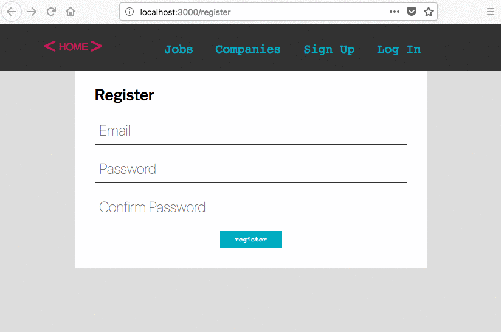
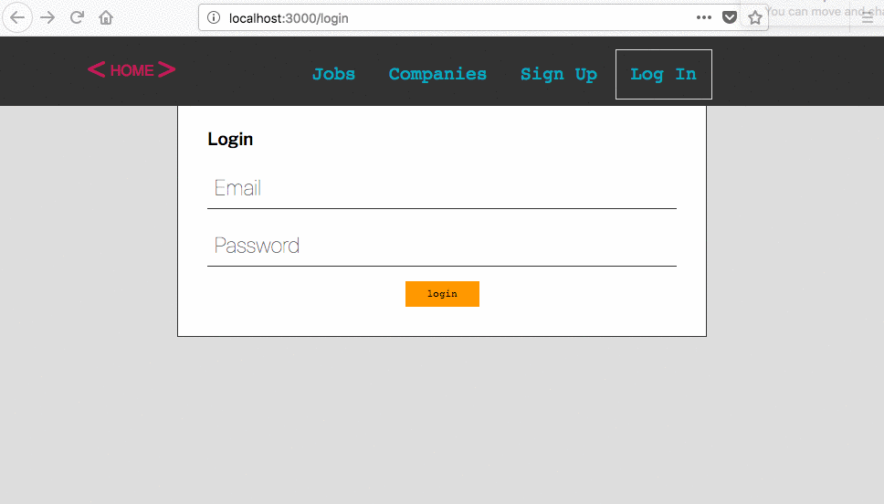
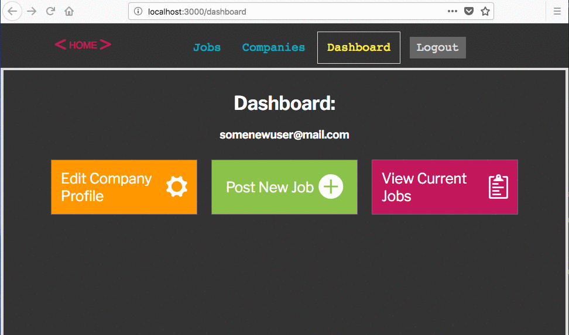
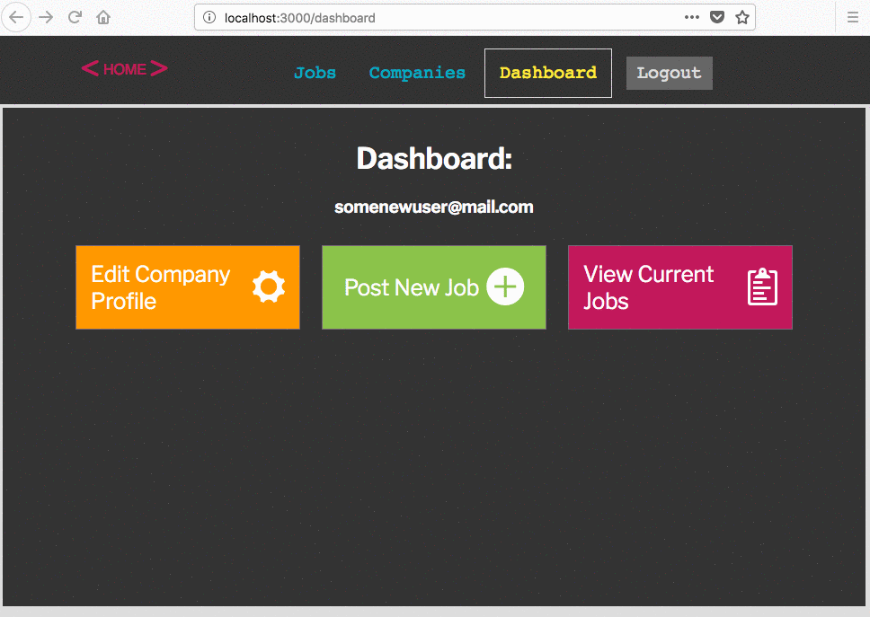

# Full Stack JS Project - React API Integration
**`fullstack-js-09--react-api-integration`**


## Context
You are going to build a full stack web application with node.js + React. In order to become familiar with how a node project works, you will be responsible for configuring the  initial major components of the project.  

- express server
- application routes
- views
- api layer
  - data access
  - data models + relations (ORM)
  - RESTful routes
- authentication
  - initial configuration
  - application integration
  - protected routes
- React
  - initial configuration
  - application api integration
  - **application auth integration** [this assignment]
  - application api integration w/ protected routes

## The Assignment
Create the React components that allow a user to register, login, and logout. When a user logs in, they should

###  Overview

For this assignment you will need to configure the React components to connect to the backend authentication. You will need

###  Requirements

+ Install react-notification-system as project dependency

  `npm install --save react-notification-system`

+ Configure `RegisterForm` so that user can register a new account using the application's authentication API (sends a POST request to `/auth/register`)
  + Handle basic submission errors (no email, no password, incorrect password + confirmation) with react-notification-system library.

+ Configure `LoginForm` so that user can authenticate.
  + Handle basic submission errors (no email, no password, incorrect password + confirmation) with react-notification-system library.
  + Successful login should send user to the `/dashboard` route

+ Configure `Nav` component to show proper navlink buttons based on if a user is authenticated.
  + For unauthenticated users : _Login_ and _Sign Up_ buttons should render.
  + For authenticated users: _Dashboard_ and _Logout_ buttons should appear.
  + There should be a _Logout_ button that should respond to a click event by sending a POST request to `/auth/logout`.

+ Configure `Dashboard.js` component to block unauthenticated user from using the dashboard.

+ Configure `App` component to check the `/auth/current` route for an authenticated user's session when the app initializes.
  + If there is a current user, then put the server's response on the `App` component's state


### Expected Functionality


#### Registering Users
  + `RegisterForm` validates improper submission, and shows an error notification

  + `RegisterForm` creates a new user with a POST request to `/auth/register`) if submission fields are valid

  


#### Authenticating Users

  + `LoginForm` authenticates a user by sending their credentials in a POST request to `/auth/login`

  + Successful authentication sends user to `/dashboard`

  + Unsuccessful authentication shows an error notification

  


#### Logging Out + Restricting Dashboard Access
  + _Logout_ `<span>` element on `Nav` should log out the user with a POST request to `/auth/logout` and route the user to the `/login` route

  + When logged out, access to `/dashboard` route is restricted

  

#### App Checks for Authenticated User

  + When user refreshes the page or navigates away and returns, they should still be able to access the Dashboard on the `/dashboard` route

  


## Setup Instructions

In Terminal:

```sh
# (1) navigate to your project--devjobs directory
cd ~/Documents/muktek/assignments/project--devjobs

# (2) Commit your changes from the previous demo
git add .
git commit -m 'committing work from part-09-react-api-integration'


# (3) Merge changes to master
git checkout master
git merge part-09-react-api-integration


# (4) You will work on the part-09-react-api-integration branch for this feature
git checkout -b part-10-react-auth-integration

```
