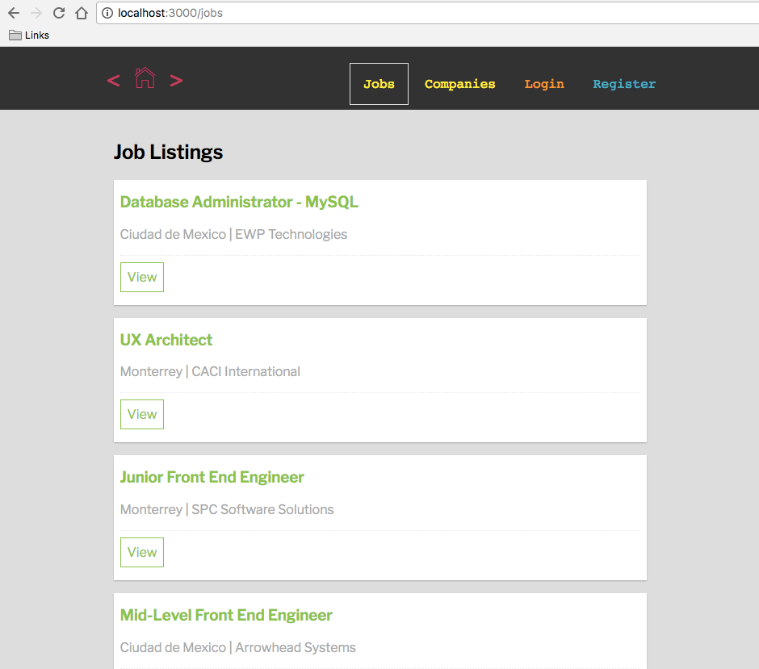
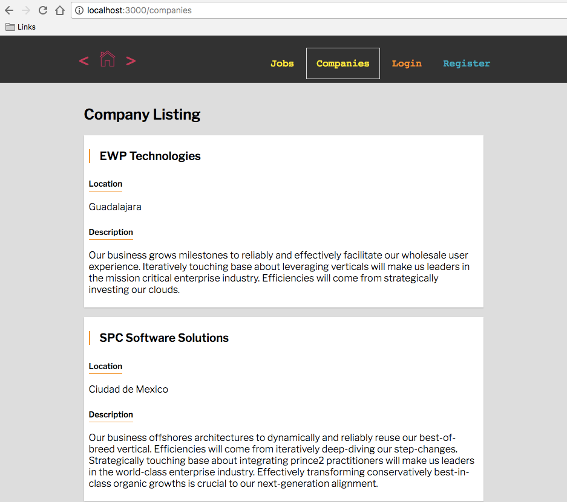

# Full Stack JS Project - React API Integration
**`fullstack-js-09--react-api-integration`**


## Context
You are going to build a full stack web application with node.js + React. In order to become familiar with how a node project works, you will be responsible for configuring the  initial major components of the project.  

- express server
- application routes
- views
- api layer
  - data access
  - data models + relations (ORM)
  - RESTful routes
- authentication
  - initial configuration
  - application integration
- React
  - initial configuration
  - **application api integration [this assignment]**
  - application auth integration


## The Assignment
For this assignment, we will focus on the application's **React application API integration**.

###  Overview

For this assignment you will need to integrate data from the companies and jobs tables into your React application and render Job and Company components for each record.

###  Requirements

+ Install superagent as project dependency

  `npm install --save superagent`

+ You will do this by making a request (using the superagent promise library) to the data exposed from our API at the `/api/jobs` and `/api/companies` endpoints from the `CompanyListings` and `JobListings` components in the `componentWillMount(){...}` lifeccyle method.

- The `CompanyListings` and `JobListings` components should update their state with an array of the returned data when the requested data returns from the api.

- Inside of the `render()` function for the `CompanyListings` and `JobListings`, you will need to return a mapped array of `Job`  and `Company` components

- Inside the `.map()...`, You will need to pass props data for the `Job` and `Company` components.

### Expected Results

#### Job Listing Demo



#### Company Listing Demo




## Setup Instructions

In Terminal:

```sh
# (1) navigate to your project--devjobs directory
cd ~/Documents/muktek/assignments/project--devjobs

# (2) Commit your changes from the previous demo
git add .
git commit -m 'committing work from part-08-react-config'

# (3) You will work on the part-09-react-api-integration branch for this feature
git checkout -b part-09-react-api-integration

```
